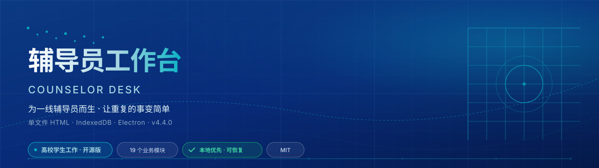

# 辅导员工作台 · Counselor Desk

### 为高校辅导员、班主任与学生工作团队准备的本地化工作桌

把学生台账、谈心谈话、重点关注、班团工作、资料归档、导入导出与备份恢复，放进一个可以自己掌握、随时接着做下去的工作空间。

  
  
  
  
  

  
  
  
  
  

🌐 [在线体验](https://7752777.github.io/counselor-desk/)　·　📦 [版本与下载](https://github.com/7752777/counselor-desk/releases)　·　📖 [快速上手](./docs/quick-start.md)　·　🧭 [用户手册](./docs/user-guide.md)　·　🛟 [备份与迁移](./docs/v4-migration-and-backup.md)　·　💬 [参与共建](https://github.com/7752777/counselor-desk/issues)

> **公开体验状态说明**：在线体验当前展示的是已经公开的 **v4.0.0**。正在收口的 v4.1–v4.4 包含分页、批量处理、统一恢复、桌面构建门禁等改进，但尚未完成统一发布；在 Release 出现对应版本、校验文件与验证记录前，请不要把它们当作已上线能力。

---

## 👋 这是一张工作桌，不是一套替代学校系统的大平台

辅导员的日常，往往不是缺少表格，而是缺少一处能把表格、跟进、材料和交接串起来的地方：开学时要接一张字段各异的名单，平时要补一段谈话记录，临近节点又要翻找去年的通知、模板和处理痕迹。换电脑、清浏览器或交接岗位时，最怕的是“做过，但找不到”。

辅导员工作台从这些小麻烦出发，服务的是一线工作中的**整理、跟进、回看、交接与恢复**。它默认本地优先，不要求注册账号；它也不替代学校的学工系统、心理专业评估、应急处置或正式审批流程。

| 一线常见场景 | 工作台希望帮你少做的事 |
| --- | --- |
| 📄 学校导出的表头每次不一样 | 少一次手工重排：先识别、映射、预览，再确认写入；未知列保留为可追溯信息。 |
| 🧩 谈话、预警、请销假、住宿分散在不同表里 | 少一次来回翻找：把记录放回学生或事项的上下文。 |
| 🗂️ 通知、模板、政策、名单反复找 | 少一次“文件在哪”：把常用材料分类留在本地资料库。 |
| 💻 换机、交接、清理浏览器担心数据丢失 | 少一次靠运气：在重要操作前导出备份、建立恢复点、保留迁移路径。 |
| 🔒 不愿把学生信息交给陌生云端 | 少一层不必要暴露：默认不要求项目账号，数据由使用者和学校制度共同管理。 |

## ✨ 面向日常工作的功能地图

### 👥 学生台账：不只是一张名单

Excel / CSV 导入、动态字段、组合筛选、排序、卡片与照片花名册，让台账能够跟着学院的字段口径走。对于没有预设的列，工作台优先保留，而不是静默丢弃。

### 💬 跟进与留痕：记录要有前因后果

谈心谈话、重点关注、请销假、考勤、住宿、学业预警、班团组织、党员发展、任务和工作节点可以围绕学生与事项回看。它帮助记录“已经做了什么、下一步要做什么”，而不是替代专业判断和正式程序。

### 🗃️ 资料、表单与专题台账：找得到，也带得走

把政策、模板、通知、讲话稿、资助、就业与其他常用材料放进有分类的本地资料库；结合导入预览、字段选择和导出，减少临时收集材料时的慌乱。

### 🛟 备份与迁移：重要的是可恢复

网页模式使用浏览器本地存储，桌面模式使用本机数据目录与附件库。无论导入、覆盖、换机还是交接，都建议先留下备份。详细边界见 [备份与迁移](./docs/v4-migration-and-backup.md)。

## 📸 看看它如何陪你做完一天的工作

所有截图均使用演示或脱敏数据。它们展示的是公开版本的实际界面，而不是承诺尚未发布的功能。

### 01 · 从今日概览开始安排节奏

### 02 · 在学生台账中找到重点

### 03 · 导入前先看清每一列

### 04 · 让谈心谈话能接着往下做

### 05 · 为换机和备份留好位置

### 06 · 把常用材料收在本地资料库

### 07 · 重点关注既要及时，也要克制

### 08 · 在窄屏设备上继续处理工作

## 🚀 从这里开始

1. **先选择使用方式**：想快速体验，可打开 [在线体验](https://7752777.github.io/counselor-desk/)；需要离线使用或桌面端，请以 [Release](https://github.com/7752777/counselor-desk/releases) 中实际存在的安装包和校验文件为准。
2. **先用示例或脱敏数据**：第一次不要导入唯一的一份原始学生表。先用一小份脱敏样表走完“导入预览 → 确认 → 查找 → 备份”。
3. **重要操作前先留退路**：大批量导入、清空、覆盖、换电脑和交接前，先导出备份或建立恢复点。
4. **按学校制度管理敏感信息**：心理、健康、纪律、家庭、资助和党团材料，应使用受控设备、受控账户与受控备份介质。

更细的第一步请看 [三分钟快速上手](./docs/quick-start.md)，按场景使用请看 [用户手册](./docs/user-guide.md)。

## 🔐 本地优先，也要把边界说清楚

- 默认不要求账号，不以项目服务器集中收集学生业务数据。
- 照片用于本地归档与人工确认，不进行人脸识别或生物特征分析。
- 导出、截图、备份和诊断文件都可能包含敏感信息；在 Issue、群聊、培训和演示中只能使用虚构或脱敏数据。
- “离线可用”不等于“一切自动加密”。请结合学校制度管理电脑、系统账户、浏览器、桌面数据目录与备份介质。

阅读 [隐私与安全边界](./docs/v4-privacy.md) 了解完整说明；发现安全问题请按 [安全政策](./SECURITY.md) 私密报告。

## 🧱 一轮轮把事情做细：v4 系列历程

这份项目不是一次性堆出功能，而是在本地工作流、导入兼容、资料归档、桌面存储与恢复路径上持续收口。下面同时标出公开版本与尚未发布的研发节点，方便读者分清“已可下载”与“正在验证”。

| 版本节点 | 时间 | 本轮重点 | 公开状态 |
| --- | --- | --- | --- |
| 🧱 **v4.0.0** | 2026-08-07 | 动态字段、附件与资料库、导入导出、网页/桌面本地工作流基础。 | **已公开** |
| 🛟 **v4.1** | 2026-08-12 | 保存状态、写入队列、版本历史、恢复点与诊断能力的研发收口。 | 开发验证中 |
| 📚 **v4.2** | 2026-08-13 | 学生分页、批量处理、筛选方案、列视图、历史学号与时间线。 | 开发验证中 |
| 🧩 **v4.3** | 2026-08-13 | 班团组织、党员发展、成绩帮扶、危机流程与专题入口。 | 开发验证中 |
| 🌟 **v4.4** | 2026-08-13 起 | 欢迎体验、迁移恢复、性能回归、跨平台构建门禁与公开发布收口。 | 最终验证中 |

这条路线不是为了堆版本号。每一轮都围绕一个很具体的目标：少翻一张表、少漏一次跟进、少在交接时断掉一段脉络。事实性的变更记录见 [CHANGELOG](./CHANGELOG.md)，发布验证范围见 [发布状态](./docs/v4-acceptance-report.md)。

## 📚 文档中心

| 你想做什么 | 从这里开始 |
| --- | --- |
| 🌱 第一次打开工作台 | [快速上手](./docs/quick-start.md) / [开始使用](./docs/getting-started.md) |
| 🧭 按业务场景学习 | [用户手册](./docs/user-guide.md) |
| 🧾 查字段、导入和数据关系 | [数据参考](./docs/data-contract.md) |
| 💾 迁移、恢复、换机或交接 | [备份与迁移](./docs/v4-migration-and-backup.md) |
| 🖥️ 安装桌面端 | [桌面端安装说明](./docs/v4-desktop-installation.md) |
| 🛠️ 构建、测试与参与开发 | [开发与贡献](./docs/development.md) / [贡献指南](./CONTRIBUTING.md) |
| ✅ 查看真实发布范围与限制 | [发布状态](./docs/v4-acceptance-report.md) |

## 🤝 欢迎一起把它做得更贴近不同学校

全国高校的字段口径、材料习惯和流程要求并不一样。欢迎在不包含真实学生信息的前提下，提交：导入样表结构、字段建议、使用场景、复现步骤、文档修订或测试改进。

项目采用 [MIT License](./LICENSE)，欢迎学习、借鉴、二次开发，也欢迎把更适合一线工作的经验带回来。

---

### 💛 让信息更清楚，让跟进更连续，让每一份用心都有迹可循。

**辅导员工作台 · Counselor Desk**

