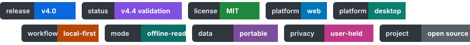

# 辅导员工作台 · Counselor Desk

### 为高校辅导员、班主任和学生工作团队准备的一张本地数字工作桌

把学生台账、谈心谈话、重点关注、班团工作、资料归档、导入导出与备份恢复，放进一个清楚、可信、能够长期使用的本地工作空间。

🌐 [在线体验](https://7752777.github.io/counselor-desk/)　·　📦 [下载与版本](https://github.com/7752777/counselor-desk/releases)　·　📖 [三分钟上手](./docs/quick-start.md)　·　🧭 [用户手册](./docs/user-guide.md)　·　💬 [参与共建](https://github.com/7752777/counselor-desk/issues)

> **这不是替代学校正式业务系统的“大平台”。** 它更像是辅导员自己的工作桌：今天要回访谁、哪张表还没处理、某位学生已经发生过什么、换电脑前怎样把资料带走，都可以从这里继续做下去。

---

## 🌱 从一线工作里的小麻烦开始

学生工作真正累人的，常常不是录入一条数据，而是资料散在 Excel、群文件、聊天记录和不同电脑里。开学时要导一张大表，平时要补一段谈话记录，临近节点又要找去年的通知、模板和名单；一旦换电脑或交接，最怕的是“明明做过，却找不到了”。

辅导员工作台想做的事情很朴素：把这些高频、细碎、需要反复回看的工作理成一条**能继续、能回看、能交接、能恢复**的路径。它不要求先搭一套复杂系统，也不要求把学生数据交给陌生的云端服务。你可以从学生、待办、表格或资料中的任何一个入口开始。

| 你可能正在面对 | 工作台希望帮上什么忙 |
| --- | --- |
| 📄 学校每次导出的表头都不一样 | 先识别、映射和预览，再写入；不认识的字段先保留，不悄悄丢掉。 |
| 🧩 学生档案、谈话、预警和任务分散维护 | 围绕学生建立可回看的记录脉络，减少来回翻找。 |
| 🗂️ 政策、模板、通知和材料难以归档 | 用本地资料库按类别保存、搜索和导出常用材料。 |
| 💻 换电脑、清浏览器或交接时担心丢数据 | 通过备份、恢复点和迁移包，给每次重要操作留一条退路。 |
| 🔒 不希望学生信息被带到陌生平台 | 默认本地优先，不要求账号；数据边界由使用者和学校制度共同决定。 |

## 🧭 你可以从任何一个入口开始

### 👥 学生台账，不只是一张名单

支持 Excel / CSV 导入、动态字段、筛选、排序、表格、卡片和照片花名册。标准字段之外，本校常用的班级、住宿、关注类型、培养层次等信息可以按自己的工作习惯维护；未知列不会因为没有预设字段而直接消失。

### 💬 日常跟进，有记录也有上下文

谈心谈话、重点关注、学业预警、请销假、住宿、班团组织、党员发展和工作留痕可以围绕学生或工作事项串起来。它不替代学校的正式审批和专业评估，但能帮助把“已经做了什么、下一步要做什么”留得更清楚。

### 🗃️ 资料和表格，找得到也带得走

通知、表单、政策、讲话稿和工作材料可以归档到本地资料库。导出前选择字段、检查用途；导入前先预览、确认映射和处理冲突，尽量把错误挡在真正写入之前。

### 🛟 数据安全，不把退路寄托在运气上

网页模式使用浏览器本地存储，桌面模式面向本地数据库与附件管理。重要导入、清空、覆盖或迁移前，都应先建立恢复点或导出备份。这里的“本地”不等于天然安全，敏感数据仍应放在受控设备和学校允许的环境中。

## ✨ 目前公开版的工作地图

| 工作场景 | 已公开的基础能力 | 能帮你减少什么 |
| --- | --- | --- |
| 👥 学生管理 | 台账、动态字段、筛选排序、卡片 / 照片视图、导入导出、附件关联。 | 少在多份名单和花名册间来回查找。 |
| 🗓️ 日常工作 | 任务、谈话、重点关注、请销假、考勤、住宿、工作节点与资料管理。 | 将“待处理”和“已留痕”放在同一张工作桌上。 |
| 🧑‍🤝‍🧑 专项台账 | 班团组织、党员发展、学业预警与帮扶、奖助勤补、就业与政策资料。 | 把常见专题从零散表格中收回来。 |
| 🔁 数据迁移 | JSON 备份、手机文件交换、桌面与网页间的数据迁移基础。 | 换设备、演示、交接时有明确的数据出口。 |
| 🖥️ 使用方式 | 单 HTML 网页、Windows 桌面端和 macOS 桌面端的现有公开版本。 | 按自己的设备和工作习惯选择合适入口。 |

> 📌 **版本边界**：具体可下载文件、平台支持、哈希和签名状态，以 [Release 附件](https://github.com/7752777/counselor-desk/releases) 及说明为准。不要把开发分支、截图或仓库源码当作已经验证的安装包。

---

## 🚀 三分钟开始使用

1. **先选一种使用方式**：从 [Releases](https://github.com/7752777/counselor-desk/releases) 选择实际存在、版本说明与校验信息完整的文件。网页版可直接体验；桌面端请按平台下载。
2. **先用脱敏数据走一遍**：第一次打开，建议先用示例或脱敏样表熟悉学生台账和导入预览，不要立即导入唯一的一份原始数据。
3. **重要操作前先留退路**：在“备份与迁移”创建恢复点或导出一份备份；大批量导入、换电脑或交接前重复这一动作。
4. **敏感信息按制度管理**：心理、健康、纪律、家庭情况和党团材料，应按学校制度控制设备、权限、备份介质与交流范围。

想一步步操作？从 [三分钟快速上手](./docs/quick-start.md) 开始；需要按模块查功能时，打开 [用户手册](./docs/user-guide.md)。

## 📸 看看日常工作会如何展开

下面图片均使用演示或脱敏数据。它们不是装饰性的“效果图”，而是为了帮助你判断工作台是否适合自己的工作节奏。

### 🏠 从今天的待办开始

### 🔎 在学生台账里找到重点

### 📥 导入前先看清每一列

### 🗣️ 让谈话记录能接着往下做

### 💾 为换机与备份留好位置

### 🗂️ 把常用材料收在一起

### 🧡 重点学生工作，既要及时也要克制

### 📱 在不同设备上保持清楚

## 🔐 本地优先，也要把边界说清楚

- 默认不要求账号，不以项目服务器集中收集学生业务数据。
- 照片仅用于本地归档和人工确认，不进行人脸识别或生物特征分析。
- 工作台协助记录、提醒和整理，不能替代学校正式流程、心理专业评估、紧急处置或党员发展审批。
- 截图、备份、诊断包和导出文件都可能包含敏感信息。公开交流、Issue 和示例中只能使用虚构或脱敏数据。
- “可以离线使用”不等于“自动加密一切”。请结合学校制度使用受控电脑、系统账户、访问权限和备份介质。

详细说明见 [隐私说明](./docs/v4-privacy.md) 与 [迁移和备份说明](./docs/v4-migration-and-backup.md)。

---

## 🗓️ 一轮轮把事情做细的 v4 系列

工作台从一张本地工作表开始，逐渐把导入、附件、桌面存储、专项台账和数据恢复补齐。下面是 v4 系列的公开开发记录。只有列为“已公开”的版本才代表公开可下载版本；其余节点说明持续开发与验证方向。

| 版本 | 时间 | 这轮沉淀了什么 | 状态 |
| --- | --- | --- | --- |
| 🧱 **v4.0** | 2026-08-07 | 动态字段、附件、资料库、导入导出、网页与桌面数据协同基础。 | 已公开 |
| 🛟 **v4.1** | 2026-08-12 | 写入队列、保存状态、版本历史、恢复点与诊断边界的开发收口。 | 开发验证中 |
| 📚 **v4.2** | 2026-08-13 | 学生分页、批量处理、保存筛选、列视图、历史学号与时间线的开发收口。 | 开发验证中 |
| 🧩 **v4.3** | 2026-08-13 | 党团组织、党员发展、成绩帮扶、危机流程与专项模块入口的开发收口。 | 开发验证中 |
| 🌟 **v4.4** | 2026-08-13 | 欢迎体验、公开资料重整、跨平台门禁、性能与恢复测试、产品截图。 | 最终验证中 |

这不是为了把版本号写得漂亮。每一次调整，都来自一线工作中反复出现的麻烦：少翻一张表、少漏一次跟进、少在交接时丢一段脉络。完整事实记录见 [更新日志](./CHANGELOG.md) 和 [发布验证记录](./docs/v4-acceptance-report.md)。

## 📚 文档入口

| 如果你想了解 | 从这里开始 |
| --- | --- |
| 🌱 第一次使用工作台 | [开始使用](./docs/getting-started.md) / [三分钟快速上手](./docs/quick-start.md) |
| 🧭 按业务场景学习功能 | [用户手册](./docs/user-guide.md) |
| 🧾 理解字段、导入与数据关联 | [数据与迁移参考](./docs/data-contract.md) |
| 💾 做迁移、恢复或换机 | [迁移与备份说明](./docs/v4-migration-and-backup.md) |
| 🖥️ 安装桌面端 | [桌面端安装与数据路径](./docs/v4-desktop-installation.md) |
| 🛠️ 开发、测试或构建项目 | [开发与构建](./docs/development.md) |
| ✅ 查看已验证范围与限制 | [发布验证记录](./docs/v4-acceptance-report.md) |

## 🤝 一起把它做得更贴近不同学校

全国高校的工作制度、字段口径和材料习惯并不一样。欢迎用不含真实学生信息的方式，告诉项目哪些地方值得继续打磨：

- 📑 某类常见表格导入后字段没有对齐；
- 🧰 某个工作场景缺少更顺手的筛选、模板或导出方式；
- 🧭 某项功能与本校制度存在理解差异；
- 🐛 发现了能够稳定复现的问题；
- ✍️ 愿意补充测试、文档、示例或可复用的字段方案。

提交之前，请阅读 [贡献指南](./CONTRIBUTING.md)。项目采用 [MIT License](./LICENSE)，欢迎学习、借鉴、二次开发和提出更符合一线需求的改进。

---

### 💛 让信息更清楚，让跟进更连续，让每一份用心都有迹可循。

辅导员工作台 · 本地优先的学生工作工具

