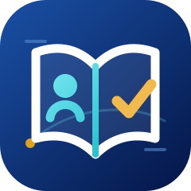
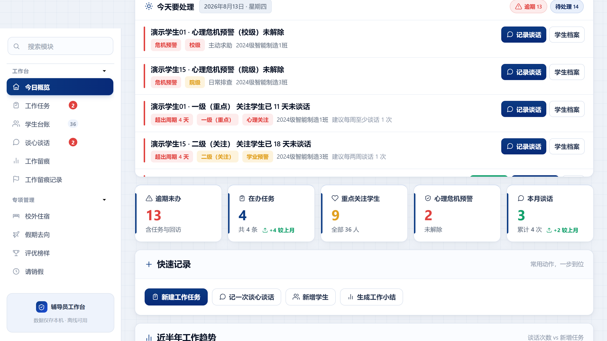
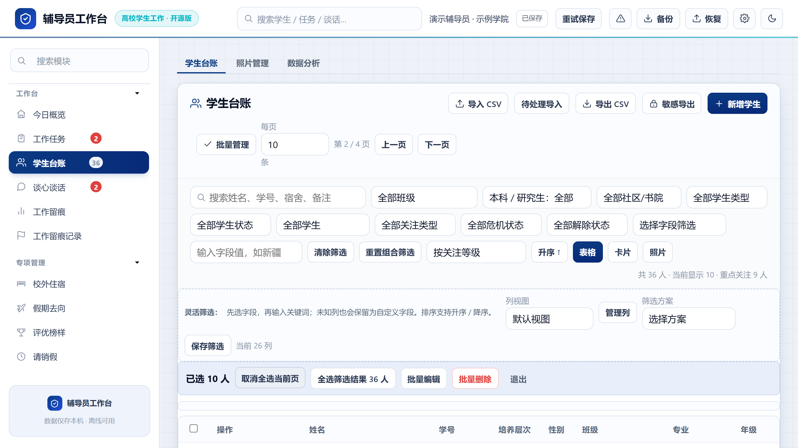
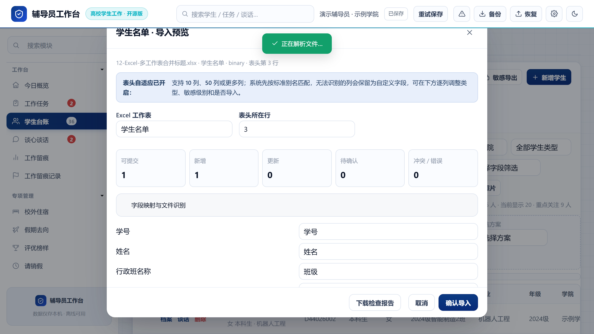
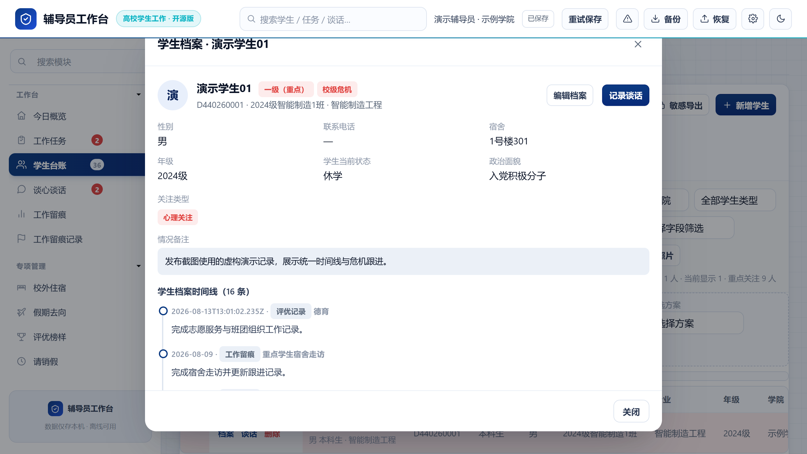
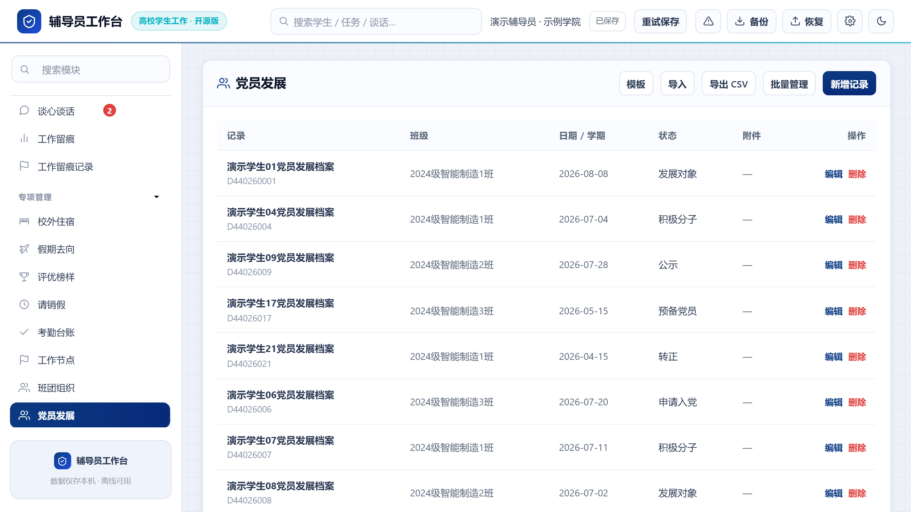
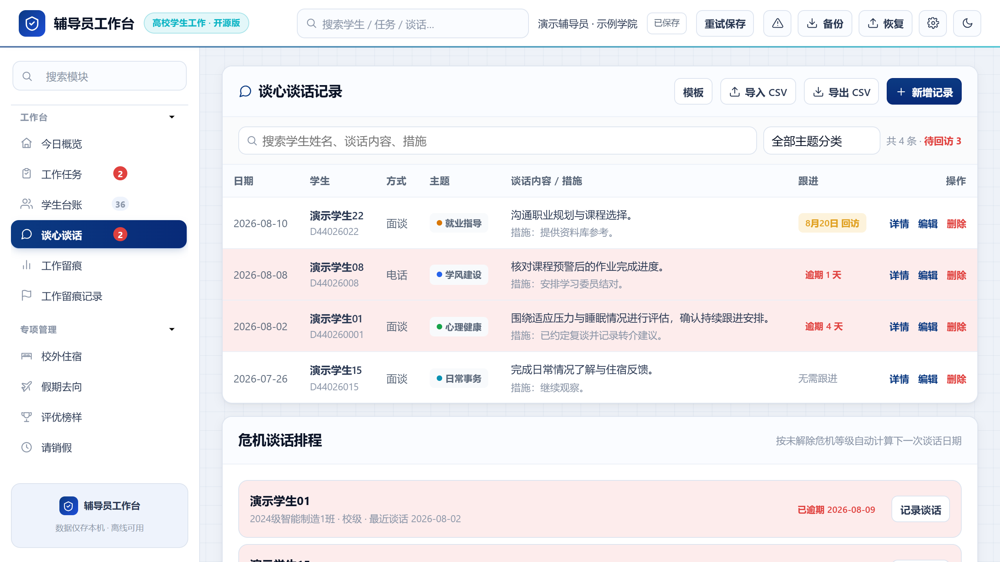
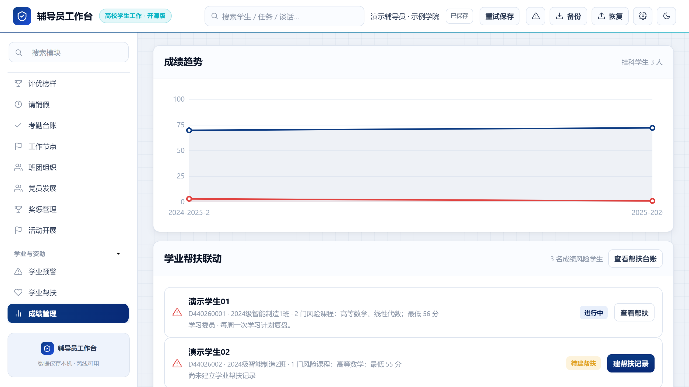
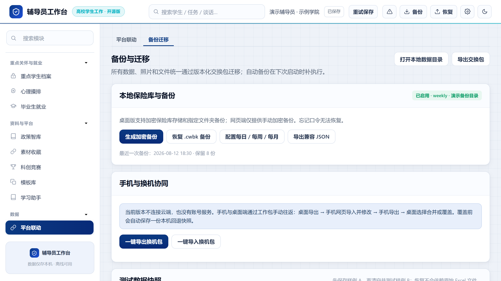

# 辅导员工作台 v4.4.5 · Counselor Desk

### 为高校辅导员、班主任与学生工作团队准备的本地优先工作台

把学生台账、谈心谈话、重点关注、班团组织、党员发展、成绩帮扶、资料归档、导入导出与备份恢复，放进一处可持续维护、可带走、也可回看的工作空间。

  
  
  
  
  

  
  
  
  
  
  

🌐 [在线体验](https://7752777.github.io/counselor-desk/)　·　📦 [版本与下载](https://github.com/7752777/counselor-desk/releases)　·　📖 [快速上手](./docs/quick-start.md)　·　🧭 [用户手册](./docs/user-guide.md)　·　🛟 [备份与迁移](./docs/v4-migration-and-backup.md)　·　💬 [参与共建](https://github.com/7752777/counselor-desk/issues)

> **v4.4.5 已正式公开。** 本批次的 AI 跨模块融合、移动端导航修复、relay 安全、仓库门禁和文档收口已随 [正式 Release](https://github.com/7752777/counselor-desk/releases/tag/v4.4.5) 交付；在线入口是 [GitHub Pages](https://7752777.github.io/counselor-desk/)，离线 HTML、Windows 安装包、macOS Universal 包和三份 SHA-256 清单均可从 Release 获取。macOS 产物未签名、未公证，请按学校的软件管理要求决定是否安装。

> **公开证据：** 发布提交为 [`44c833d1`](https://github.com/7752777/counselor-desk/commit/44c833d1bafbe51df844f81cbcc0d638e7e9621e)；[Release Actions #25](https://github.com/7752777/counselor-desk/actions/runs/32086383154) 和 [Pages 部署 #46](https://github.com/7752777/counselor-desk/actions/runs/32089792020) 均已成功。完整范围、哈希与限制见 [v4.4.5 发布收尾记录](./docs/upgrade/release-v4.4.5.md)。

---

## 🎯 这是给一线工作留出来的一张工作台

辅导员的日常不缺表格，缺的是一处能把表格、谈话、提醒、材料与交接串起来的地方：开学时接住字段各异的名单，平时记下一次谈话和下一步安排，节点前找回去年的材料，换机或交接时不让已有工作消失。

辅导员工作台默认把数据留在使用者可管理的设备上。它帮助整理、跟进、回看、交接与恢复；它**不替代**学校学工系统、心理专业评估、应急处置和正式审批流程。对敏感事项，请始终遵循所在学校的制度与授权边界。

### 为谁准备

| 使用者 | 能从工作台获得什么 |
| --- | --- |
| 🎓 高校辅导员 | 在一个界面中处理学生台账、谈话、风险提示、专题材料与交接准备。 |
| 🧑‍🏫 班主任、年级辅导团队 | 用同一套字段、筛选与档案脉络减少重复登记，保留本校的工作口径。 |
| 🗂️ 学工办公室与专项负责人 | 维护班团、党务、奖惩、活动、成绩、住宿等专题记录，并在需要时导出或交接。 |
| 🔧 希望二次开发的高校团队 | 在 MIT 许可下参考本地优先、导入兼容、迁移恢复和公开测试的实现。 |

| 一线常见场景 | v4.4 想解决的实际问题 |
| --- | --- |
| 📋 名单字段每次都不一样 | 导入前先识别、映射、预览和确认；未知列保留为可追溯信息，不静默丢弃。 |
| 🔎 记录散落在许多表格里 | 用学生档案时间线把谈话、危机、成绩、住宿、奖惩、活动、党团与任职重新放回上下文。 |
| 🧩 功能藏得深、找起来慢 | 班团组织、党员发展、成绩管理、奖惩、活动、住宿和工作留痕都有清晰入口。 |
| 🛟 换机、交接、清理浏览器有风险 | 提供恢复点、版本历史、备份、迁移与诊断路径，让重要操作有退路。 |
| 🔐 不希望把学生信息交给陌生云端 | 默认本地优先，不要求项目账号；备份、导出与设备安全由使用者和学校制度共同管理。 |

## ✨ v4.4.5 的核心体验

### 👥 学生台账，终于可以像台账一样反复使用

- 真正的 `10 / 20 / 50 / 100` 分页，记住每页条数、当前页、筛选、排序与显示模式。
- 组合筛选覆盖社区/书院、培养层次、学生状态、关注类型、危机等级和预警解除状态。
- 当前页选择、全选筛选结果、批量编辑、批量删除、差异确认与一次撤销；删除后保留合理页码。
- 个人列视图、保存筛选方案、字段分组、列顺序与宽度配置；表头、选择列和操作列保持可见。
- 卡片、表格、照片名册三种视图，并提供面向大表的横向滚动入口。

### 🧭 让学生工作的脉络重新连起来

- 学生档案统一时间线聚合谈话、危机、成绩、住宿、奖惩、活动、工作留痕、党团与组织任职。
- 谈心谈话支持附件、计划排程、危机等级频率、逾期提醒与下一次谈话日期。
- 心理危机围绕发现、评估、联系、干预、转介、跟踪、闭环组织记录，不替代专业判断。
- 成绩模块提供趋势、挂科分布、课程风险、班级对比，并把风险学生与学业帮扶记录连起来。

### 🏫 让专项工作回到看得见的位置

- 班团组织支持岗位、任期、空缺、换届、继任和批量任职。
- 党员发展保留申请、积极分子、发展对象、公示、异议、预备党员与转正的独立档案线索。
- 奖惩、活动、成绩、住宿、工作留痕与资料库提供独立入口、创建编辑、筛选、导入导出和时间线关联。

### 📥 导入、导出与恢复，先把边界说清楚

- 导入支持映射模板、多工作表、合并单元格、多行表头、序号列决策、任务进度、暂停、取消、重试、冲突处理与回滚。
- XLSX、DOCX、PDF 共用导出边界：字段选择、脱敏预览、页眉页脚、Logo、版式与审计记录。
- schema v8 保留内部 ID、附件关联、历史学号和自定义字段；迁移前建立恢复点。
- 网页端以 IndexedDB 为主，桌面端使用本地 SQLite 与附件仓；不可用时会明确提示兼容模式和应急导出，不静默降级。

## 🗓️ 一天怎样在这里连续起来

**早上**，从今日概览看待办、回访日期和需要先处理的事项；**白天**，在学生台账里用班级、关注类型、危机等级或自定义字段快速收窄范围，批量更新已经确认的共性信息；**谈话后**，把事实、后续动作和下一次回看日期留在记录中；**节点前**，从党务、班团、成绩、活动或资料库的独立入口整理材料；**下班前**，建立恢复点或导出备份，让换设备、交接和误操作都有可追溯的退路。

这不是要求把所有事情都塞进一个系统，而是让每次已经做过的工作能找到、接得上、交得出去。

## 🖼️ v4.4.5 界面一览

以下截图均来自隔离的虚构演示数据。每张均为单独的 `2560 × 1440` PNG，不含真实学生信息。

### 01 · 今日概览

### 02 · 学生分页与批量管理

### 03 · 复杂导入预览

### 04 · 学生档案时间线

### 05 · 党员发展

### 06 · 谈话与危机排程

### 07 · 成绩与学业帮扶

### 08 · 备份与迁移

## 🚀 从这里开始

1. **先选使用方式。** 想直接体验功能，可打开 [在线体验](https://7752777.github.io/counselor-desk/)；想断网使用或长期维护本机数据，可从 [v4.4.5 Release](https://github.com/7752777/counselor-desk/releases/tag/v4.4.5) 下载离线 HTML、Windows 安装包或 macOS Universal 包，并先核对 Release 附带的 SHA-256 清单。
2. **先用演示或脱敏数据走一遍。** 按“导入预览 → 确认写入 → 查询 → 建立恢复点 → 导出备份”完成一次练习，再接入正式台账。
3. **把敏感信息放在受控环境。** 不在 Issue、截图、培训材料或公开演示中提交真实学生数据；重要操作前先建立恢复点或导出备份。
4. **按你的工作节奏定制。** 在设置中填写称呼、学院与主题色；在学生台账中保存常用筛选和列视图。

第一次使用请阅读 [三分钟快速上手](./docs/quick-start.md)，按场景处理工作请查阅 [用户手册](./docs/user-guide.md)。

## 🪜 一次次把工作做细：完整版本历程

这不是为了堆版本号的时间线。每一轮升级都从一线反复出现的麻烦出发：少翻一张表、少漏一次跟进、少在交接时断掉一段脉络。

| 版本 | 时间 | 这一轮带来的改变 |
| --- | --- | --- |
| 🧱 **v3.8.0** | 2026-08-04 | 从可靠导入起步：支持 xls / xlsx / CSV 名单、常见表头识别、校验与未知字段保留，让不同来源的名单先能安全进来。 |
| 🌿 **v3.9.0** | 2026-08-05 | 加入首次使用引导、主题设置、导入预览、导入快照与手机工作包，为“本地工作流”铺好基础。 |
| 🌱 **v4.0** | 2026-08-07 | 建立网页与 Electron 桌面端的共同基础：动态字段、附件、资料库、导入导出、备份恢复与本地数据层。 |
| 🛟 **v4.1** | 2026-08-12 | 围绕“保存后能否放心”：补齐 schema v8、写入队列、保存状态、版本历史、恢复点、失败重试与诊断边界。 |
| 📋 **v4.2** | 2026-08-13 | 围绕“台账能否反复用”：重做真实分页、批量处理、保存筛选、个人列视图、重复提示、历史学号与统一时间线。 |
| 🏫 **v4.3** | 2026-08-13 | 围绕“专项工作能否找得到”：收口班团组织、党员发展、成绩帮扶、危机流程、活动、奖惩、住宿和工作留痕入口。 |
| 🚀 **v4.4.0** | 2026-08-13 | 围绕“能否安心交付”：统一欢迎体验、迁移恢复、便携隔离、性能回归、跨平台构建门禁、八张产品截图与公开资料；2026-08-14 完成正式 Release 与 Pages 发布。 |
| 🧰 **v4.4.1** | 2026-08-14 | 面向真实安装与公开使用继续打磨：Windows 桌面端隐藏系统默认菜单，整理下载、安装、迁移、验收与归档说明，所有平台附件仍按同一发布门禁交付。 |
| 🌿 **v4.4.2** | 2026-08-14 | 把首次打开的教育场景、每日金句背景、窄屏分页排版与离线资源一并收口：网页、离线 HTML 和桌面包不再依赖错误的相对路径，使用体验与公开说明同步更新。 |
| 🧭 **v4.4.3** | 2026-08-14 | 面向真实高校表格继续加固：识别更多日期写法和教务成绩列，避免大批量导入被旧本地快照容量拦截；修复离线 HTML 中 Excel 运行库的完整性，并把导入撤销记录接入持久化工作区。 |
| 🧠 **v4.4.4** | 2026-08-17 | 补齐本地 AI 治理、证书人工确认、日期范围工作总结、就业资源、业务档案、稳定 ID 联动和领导统计视图，并把新增集合统一接入 v8 工作区、备份、迁移与桌面边界；该版本保留为历史正式发布。 |
| 🚀 **v4.4.5** | 2026-08-18 | 完成 AI 跨模块上下文、统一建议中心、来源核验、记录级工作流、relay 安全、移动端导航和窄屏动作区收口；增加发布密钥扫描、动态 Release 说明、仓库协作模板和全量上线门禁。 |

详细事实记录见 [CHANGELOG](./CHANGELOG.md) 和 [v4.4.5 发布收尾记录](./docs/upgrade/release-v4.4.5.md)。当前正式上线版本以 v4.4.5 Release、Pages 和附件清单为准；历史版本保留在历程表中，不冒充当前下载版。

### v4.4.0 这次具体带来了什么

- **看得见的台账升级**：从“加载更多”走向真正分页、全筛选结果批选、删除可撤销和大表固定操作列。
- **看得见的入口升级**：把班团组织、党员发展、成绩、奖惩、活动、住宿、工作留痕从深层页面带回导航。
- **看不见但重要的可靠性升级**：为浏览器、便携页面和桌面端统一补上版本历史、恢复点、迁移、附件一致性和失败回滚保护。
- **看得懂的公开资料升级**：八张独立产品截图、面向老师的操作文档、面向贡献者的开发资料，以及不自动上线未验收版本的发布门禁。

## 📚 文档中心

| 你想做什么 | 从这里开始 |
| --- | --- |
| 🌱 第一次打开工作台 | [快速上手](./docs/quick-start.md) / [开始使用](./docs/getting-started.md) |
| 🧭 按工作场景学习 | [用户手册](./docs/user-guide.md) |
| 🧾 查字段、导入与数据关系 | [数据参考](./docs/data-contract.md) |
| 🛟 换机、交接或恢复数据 | [备份与迁移](./docs/v4-migration-and-backup.md) |
| ☁️ 多台设备互通数据（可选，Supabase） | [云端同步](./docs/supabase-sync.md) |
| 💻 安装桌面端 | [桌面端安装说明](./docs/v4-desktop-installation.md) |
| 🧪 了解构建、测试与参与方式 | [开发说明](./docs/development.md) / [贡献指南](./CONTRIBUTING.md) |
| 📌 查看发布证据与限制 | [版本与发布状态](./docs/v4-acceptance-report.md) |

## 🔐 本地优先，也把边界说清楚

- 项目默认不要求注册账号，也不以项目服务器集中收集学生业务数据。
- 可选的云端同步（Supabase）会把工作区数据保存到你自己的 Supabase 项目；数据按账号隔离，仅在你主动配置并登录后生效，也可以随时退出。
- “本地保存”不等于“自动加密”。请使用受控设备、系统账户、学校允许的备份介质与访问管理方式。
- 心理危机、健康、纪律处分、资助和党员发展等内容，工作台只协助留痕与跟进，不能替代学校制度、专业评估或正式审批。
- 截图、导出、备份与诊断包可能包含敏感信息。公开交流时只能使用虚构或脱敏数据。

完整说明见 [隐私与安全](./docs/v4-privacy.md)；安全问题请按 [安全政策](./SECURITY.md) 私密报告。

## 🤝 一起把它做得更贴近不同学校

不同学校的字段口径、材料习惯和工作流程并不一样。欢迎在不包含真实学生信息的前提下，提交导入样表结构、字段建议、使用场景、可复现问题、文档修订或测试改进。

项目采用 [MIT License](./LICENSE)。欢迎学习、借鉴、二次开发，也欢迎把更贴近一线工作的经验带回来。

---

### 🌟 让信息更清楚，让跟进更连续，让每一份用心都有迹可循。

**辅导员工作台 v4.4.5 · Counselor Desk**

